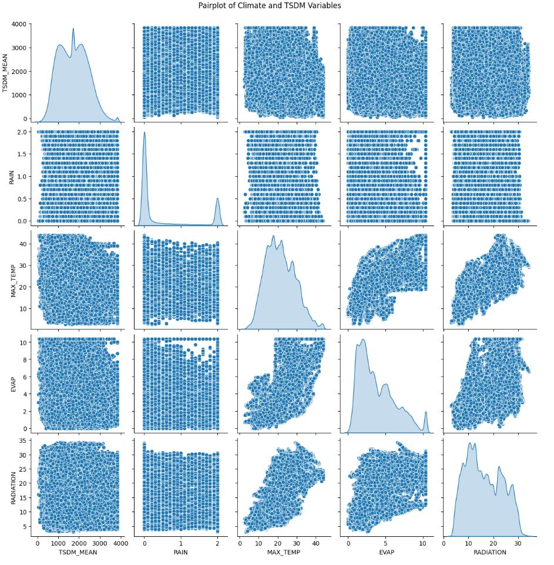
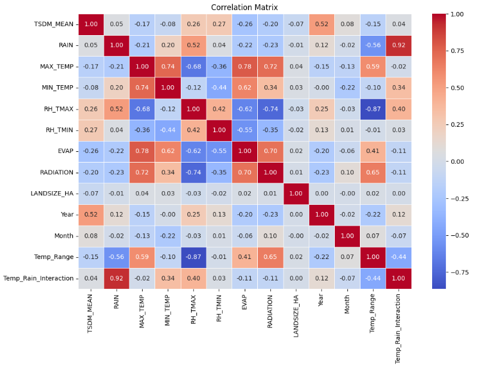
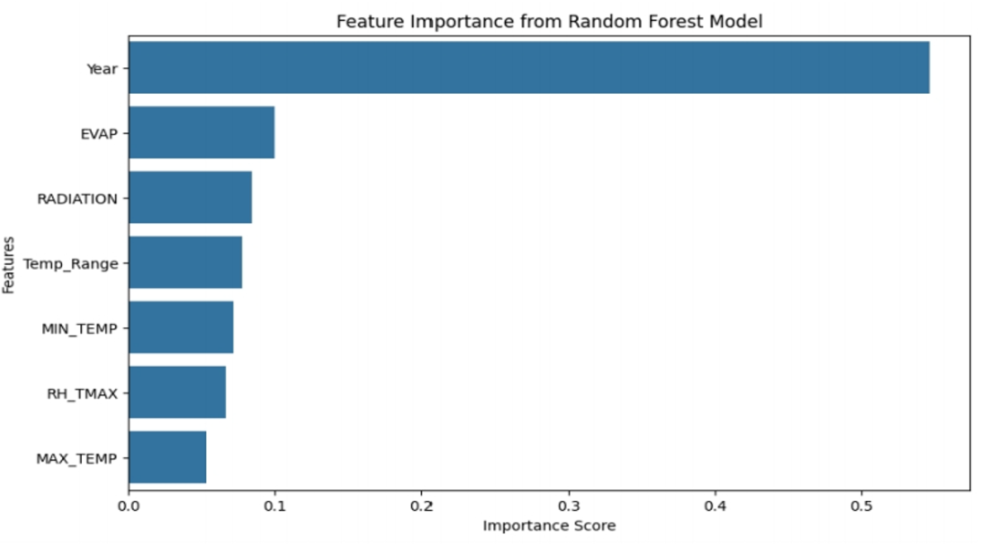
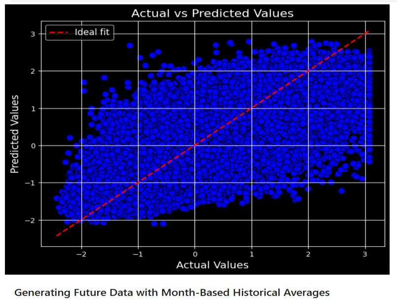
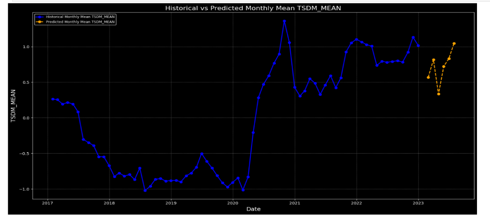

# Pasture Growth Prediction: Large-Scale ML

> Predicting Total Seasonal Dry Matter (pasture growth) across Queensland from 33 million+ environmental records, comparing Random Forest against XGBoost.

QUT Advanced Capstone (IFN703), June to November 2024.

---

## 📌 The Problem

Pasture growth, measured as Total Seasonal Dry Matter (TSDM), drives grazing capacity and stocking decisions across Queensland's agricultural land. Measuring it directly at scale is expensive and slow. This project asks a simpler question instead: can TSDM be predicted from climate and satellite data that's already being collected, and if so, which environmental factors actually matter?

## 📊 The Data

Three sources were merged into one working dataset:

- **SILO climate data**: rainfall, max/min temperature, humidity, evaporation, solar radiation
- **Satellite-derived pasture measurements**: TSDM readings by paddock
- **Paddock metadata**: land size, pasture state (filtered to grazing paddocks)

33 million+ merged records in total, spanning multiple years and paddocks across Queensland. From the raw features, two engineered ones were added: `Temp_Range` (max minus min temperature) and a month-based historical average to smooth out short-term noise.

## 🔎 Exploratory Analysis

The pairplot shows TSDM_MEAN is right-skewed with a long tail, and its relationships with individual weather variables (temperature, evaporation, radiation) are diffuse rather than a clean line, no single climate variable explains pasture growth on its own.

The correlation matrix makes the reason clearer: TSDM_MEAN's single strongest raw correlate is `Year` (0.52), well ahead of any weather variable (`RH_TMAX` at 0.26, `RADIATION` at 0.20). That early signal, a real year-on-year trend outweighing day-to-day weather, is exactly what the trained models would later confirm.

## 🔍 Methodology

- `SelectKBest` narrowed the feature set down to seven: `Year`, `EVAP`, `RADIATION`, `Temp_Range`, `RH_TMAX`, `MIN_TEMP`, `MAX_TEMP`
- 80/20 train/test split
- Two models trained and compared head to head: **Random Forest Regressor** and **XGBoost Regressor**
- `RandomizedSearchCV` hyperparameter tuning on both
- Evaluated on four metrics, not just R², to catch a model that looks good on one number but not another: MSE, RMSE, MAE, and R²

## 📈 Results

| Model | MSE | RMSE | MAE | R² |
|---|---|---|---|---|
| **Random Forest** | 0.281 | 0.531 | 0.387 | **0.717** |
| XGBoost | 0.335 | 0.579 | 0.435 | 0.664 |

Random Forest won on every metric, not just the headline R².

`Year` dominates the trained model's feature importance too, at roughly 0.55, more than five times the next feature (`EVAP`). That's consistent with what the correlation matrix already hinted at during EDA: whatever is driving TSDM year over year (management practices, longer-term climate trends, pasture recovery cycles) matters more than any single weather reading.

The actual-vs-predicted scatter clusters reasonably tightly around the ideal-fit line, with the expected wider scatter at the extremes, consistent with an R² in the low 0.7s: a model that captures the dominant trend well without overfitting to noise.

Applied forward, the model's predicted monthly averages continue the same seasonal pattern the historical data shows, rather than drifting off into an implausible trend, a useful sanity check that it's learned something real rather than an artefact of the training window.

## 💡 Takeaway

The standout finding isn't a specific weather threshold, it's that `Year` outweighs every individual climate variable in both the raw correlations and the trained model. For anyone using this for grazing decisions, that's a practical signal in itself: year-level context (rainfall accumulated over the season, longer climate trends) is worth more than any single day's weather reading when estimating pasture growth.

## 🛠️ Tech Stack

| Technology | Purpose |
|---|---|
| Python | Core language |
| Pandas / NumPy | Data merging, cleaning, feature engineering |
| scikit-learn | Random Forest, `SelectKBest`, `RandomizedSearchCV` |
| XGBoost | Gradient-boosted regression model |
| Matplotlib / Seaborn | All result visualisations |

## 📁 Files

- [`PG-UP-1.ipynb`](PG-UP-1.ipynb): full analysis notebook
- [`IFN703_Varun_Vikas_Jaiswal_n11736089.pdf`](IFN703_Varun_Vikas_Jaiswal_n11736089.pdf): exported report

---

**Author:** Varun Vikas Jaiswal (QUT, 2024)
